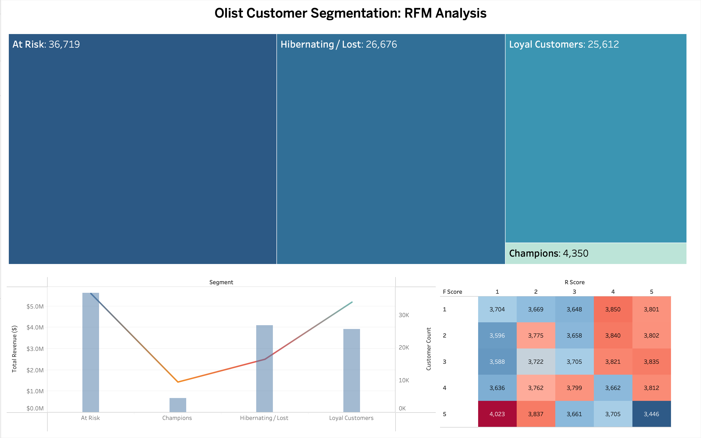

# Olist E-commerce: Customer Lifetime Value (CLV) & RFM Analysis

## 📌 Project Overview

This project analyzes **93,357 unique customers** from the Olist E-commerce dataset to identify high-value segments and churn risks. Using a combination of **Python (Pandas/SQLAlchemy)** for data engineering and **Tableau** for interactive visualization, I developed a robust segmentation engine to drive marketing strategy.

## 🛠️ Technical Challenges & Skepticism
During the research phase, I initially attempted to implement the **BG/NBD probabilistic model**. However, due to the high data sparsity (97% of customers being one-time buyers), the model failed to converge. 

So then I pivoted to a **Heuristic RFM (Recency, Frequency, Monetary) Scoring System** using quantile-based ranking. This ensured 100% data coverage and provided more stable, actionable insights for the business.

## 📊 Key Insights
* **Revenue Concentration:** The "Champions" segment represents only **4.6%** of the customer base but exhibits the highest individual value.
* **Retention Opportunity:** The "At Risk" segment (39% of customers) holds over **$5.5M** in historical revenue, marking it as the primary target for re-engagement.
* **New Growth:** A significant portion of the base consists of recent one-time shoppers ($R=5, F=1$), representing the best opportunity for a "Second-Purchase" conversion campaign.

## 🚀 Interactive Dashboard
View the full interactive analysis here: **[Live Tableau Dashboard](https://public.tableau.com/app/profile/sanjosh.khatri/viz/CustomerLifetimeValueRFMAnalysis/Dashboard1?publish=yes)**

## 💻 Technical Stack
* **Language:** Python 3.13.5
* **Database:** MySQL (Localhost)
* **Script:** `clv_model_engine.py`
* **Dataset Output:** `rfm_final_results.csv`
* **Libraries:** Pandas, SQLAlchemy, urllib.parse
* **Visualization:** Tableau Desktop Public Edition

## 🛠️ How to Reproduce
1. **Clone the repo:** `git clone https://github.com/Sanjosh2121/Olist-RFM-Analysis.git`
2. **Install dependencies:** `pip install -r requirements.txt`
3. **Configure Database:** Update the `engine` connection string in `clv_model_engine.py` with your local MySQL credentials.
4. **Run Analysis:** Execute `python clv_model_engine.py` to generate the `rfm_final_results.csv`.
